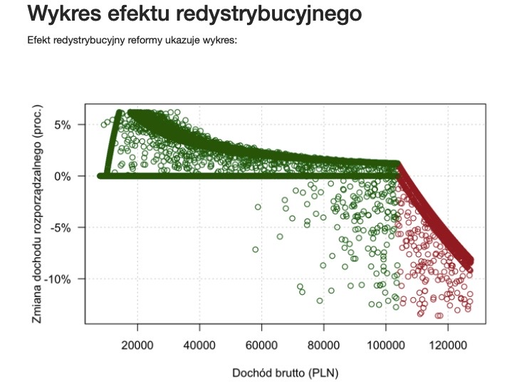

# Analityczni Liderzy

## Informacje
Repezytorium jest poswiecione konkursowi "Analityczni Liderzy" organizowanego przez Ministerstwo Finansow, w ktorym wygralem
staz w tym ministerstwie. Problem polegal na symulacji reformy podatkowej i bazujac na dziesiatkach tysiecy danych o podatnikach,
obliczeniu odpowiednich poziomow progu podatkowego, dochodow oraz wizualizacji.
Kod powstal w jezyku R, raport w srodowisku RMarkdown w roku 2021.

## Pliki
- dane_dochody.csv - plik z danymi
- projekt.R - kod
- Zadanie_konkursowe.docx - szczegolowy opis zadania
- podsumowanie.pdf - raport wygenerowany w RMarkdown

## Przykladowe dzialanie programu

